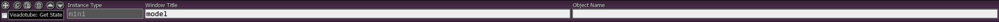
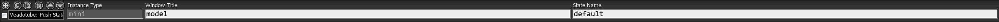
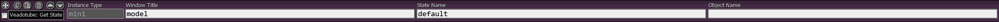

# Veadotube WebSocket
#### A Veadotube WebSocket client for SAMMI

Veadotube WebSocket is an extension for the SAMMI Bridge, and adds a WebSocket client to SAMMI for Veadotube's server. It allows SAMMI to directly communicate with Veadotube, bypassing the issues present with non-WebSocket methods (e.g. ignored inputs).

**Please note:** neither Veadotube WebSocket nor its developer are affiliated with Veadotube or SAMMI in any way, shape, or form, but this project is built on features they both provide to developers. Please see their respective websites for information regarding them.

## Features
### Available
- Get/Set the currently selected state in Veadotube using WebSocket
- Access to Veadotube instance details in SAMMI (e.g. state list, window name, server address, etc.)
- Fully automatic server discovery and client connection
- Supports multiple instances of Veadotube

### To-Do
- [x] Lay groundwork for multi-channel support
- [x] Add SAMMI commands for the remaining payloads of the "stateEvents" node
    - [x] push/pop
        - [x] *Prerequisite: Work out if the current implementation is bugged, as "push" acts the same as "set", and "pop" does seemingly nothing*
            - *Current implementation is not bugged, just confusing*
    - [x] thumb
    - [x] listen/unlisten
        - [x] *Prerequisite: Find out what the token from listening is actually used for, and from that, work out if this is useful to the extension and/or to users*
            - *Not useful to users, but will be required by the back-end with Veadotube v2.1*
- [x] Add proper support for types of Veadotube other than Mini (e.g. multiple nodes)
    - *This is theoretically done and ready on the back-end, but has no applicable front-end use-cases yet*
- [x] Rework automatic server discovery to allow for manual directory input, in case the Veadotube instances are not hosted locally
    - *Note to users: this can already be indirectly done by adjusting the lookup directory in the "Get Veadotube Instances" button*
    - *Marked as done, because as it turns out, [this doesn't matter!](https://veado.tube/help/docs/data-files/#portable)*
- [ ] Adjust the "Get State" and "Get State Thumbnail" commands to allow users to put the returned object in any location, instead of just the button it was sent from

## Commands
A handful of commands are added to SAMMI by this extension, all of them prefixed with "Veadotube:" to easily differentiate them from commands added by other extensions.

### WebSocket Server Commands
These commands are related to scanning for and connecting to instances of Veadotube.

#### Rescan for Instances

**Purpose:** In case of new Veadotube instances being opened after starting SAMMI Bridge, but being unable to reload SAMMI Bridge, this command will disconnect all currently connected instances of Veadotube, and then rescan for and connect to a new list of Veadotube instances.

**Fields:** N/A

#### Reconnect Instances

**Purpose:** In the event of a Veadotube WebSocket server disconnection, or if a connection otherwise needs to be refreshed, this command can be used to disconnect all currently connected instances of Veadotube, and then attempt to reconnect to the same list of them.

**Fields:** N/A

### State Commands
These commands are related to the states of a Veadotube Instance.

#### Get State

**Purpose:** Returns the currently selected state of a Veadotube instance. Adds an object to the button the command is sent from, which contains the name and ID of that state.

**Fields:**
- *Instance Type:* Either "Mini" or "Live", depending on the Veadotube type being messaged
- *Window Title:* The value of "window title" set in the Veadotube instance being messaged
- *Object Name:* The name of the object for the state details to be stored in

#### Set State

**Purpose:** Used to change the currently selected state of a Veadotube instance. This also clears the stack created by the "Push State" command.

**Fields:**
- *Instance Type:* Either "Mini" or "Live", depending on the Veadotube type being messaged
- *Window Title:* The value of "window title" set in the Veadotube instance being messaged
- *State Name:* The value of "state name" from any of the available states in the Veadotube instance referenced in the "Window Title" field

#### Push State

**Purpose:** Adds the given state to the top of the "stack" of a Veadotube instance. This also changes the currently selected state, as Veadotube references the top of the "stack" for that.

**Fields:**
- *Instance Type:* Either "Mini" or "Live", depending on the Veadotube type being messaged
- *Window Title:* The value of "window title" set in the Veadotube instance being messaged
- *State Name:* The value of "state name" from any of the available states in the Veadotube instance referenced in the "Window Title" field

#### Pop State

**Purpose:** Removes the given state from *all* points in the "stack" of a Veadotube instance. Use the "Push State" command to add items to the "stack".

**Fields:**
- *Instance Type:* Either "Mini" or "Live", depending on the Veadotube type being messaged
- *Window Title:* The value of "window title" set in the Veadotube instance being messaged
- *State Name:* The value of "state name" from any of the available states in the Veadotube instance referenced in the "Window Title" field

#### Get State Thumbnail

**Purpose:** Returns the thumbnail of a given state of a Veadotube instance. Adds an object to the button the command is sent from, which contains the name, ID, image width, image height, and image (as a Base64 encoded .PNG) of that state.

**Fields:**
- *Instance Type:* Either "Mini" or "Live", depending on the Veadotube type being messaged
- *Window Title:* The value of "window title" set in the Veadotube instance being messaged
- *State Name:* The value of "state name" from any of the available states in the Veadotube instance referenced in the "Window Title" field
- *Object Name:* The name of the object for the state details to be stored in

## Installation
### Prerequesites
As this is an extension for SAMMI (https://sammi.solutions/) to add a WebSocket client to Veadotube (https://veado.tube/). You will need to have both installed to use it.

No other prerequsites are required or will be provided.

### Steps
1. Make sure that the WebSocket server is turned on in Veadotube
    - Veadotube > program settings > websocket server > set to "on"

2. Open the SAMMI Bridge
    - https://sammi.solutions/docs/bridge#howtorunbridge
3. Extract "VeadotubeWebSocket.sef" from the zip file
4. Open the SAMMI Bridge extension installer
    - SAMMI > left sidebar > SAMMI Bridge > Install an Extension
5. Select the extracted .SEF file for install
6. Reload the SAMMI Bridge if it didn't do so itself
    - SAMMI > left sidebar > SAMMI Bridge > Reload a Bridge
7. Done!

From here, the extension will find and connect to all running instances of Veadotube. If you don't have any instances running, the extension will automatically rescan for instances every 5 seconds. If it successfully finds and connects to any instances, but you want to add additional instances, you can either reload the bridge (*step 6*) or use the "Veadotube: Rescan for Instances" command added to SAMMI by the extension.